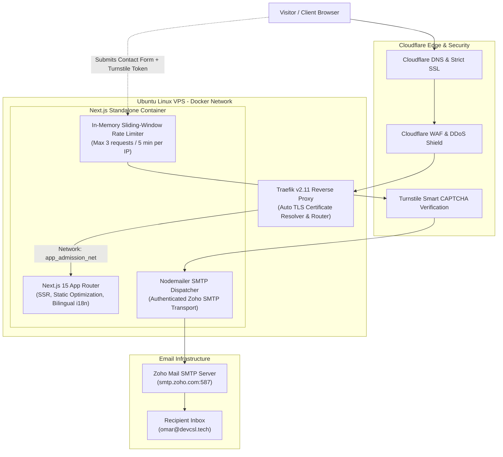

# DEV CSL — Engineering Portfolio & Technical Case Studies

<div align="center">


<br/>

**The official engineering portfolio, project case studies, and services platform of Omar Faruk.**  
Engineered with Next.js 15 App Router, featuring full bilingual internationalization (English & Bengali), defensive serverless contact pipelines with Cloudflare Turnstile anti-bot protection, and automated containerized deployment via Docker and Traefik.

[🌐 Visit Live Website: devcsl.tech](https://devcsl.tech) • [💼 Author Profile](https://github.com/cslomarfaruk) • [📬 Get in Touch](https://devcsl.tech/#contact)

</div>

---

## 🏛️ System Architecture

The site runs as a standalone Node.js container inside a Linux VPS Docker network, routed through a Traefik reverse proxy with automated Let's Encrypt TLS renewal.



---

## ⚡ Key Engineering Capabilities

### 1. Bilingual Internationalization (English & Bengali)
- Built a zero-dependency, lightweight client-side i18n system (`lib/i18n.tsx`) supporting seamless switching between English and Bengali (`content/en.json`, `content/bn.json`).
- Persists user language preference in `localStorage` without disrupting URL paths or SSR hydration.

### 2. Defensive Contact API & Anti-Abuse Funnel
The contact endpoint (`app/api/contact/route.ts`) implements enterprise-grade protection:
- **IP-Based Sliding Window Rate Limiting:** Enforces a maximum of 3 submissions per 5-minute window per IP with automated periodic garbage collection to prevent memory leaks.
- **Cloudflare Turnstile Verification:** Cryptographically validates user tokens on the server against Cloudflare's `siteverify` API before triggering SMTP transports, neutralizing automated email spam and bots.
- **Structured Payload Validation:** Validates email format, required fields, and length constraints before dispatching notifications via authenticated SMTP.

### 3. Core Web Vitals & Performance Optimization
- **Next-Gen Image Pipeline:** Next.js configured with AVIF and WebP support with a minimum cache TTL of 30 days.
- **Font Optimization:** Google Fonts preloaded with `display: swap` to eliminate layout shift (CLS) and FOIT (Flash of Invisible Text).
- **CSS Containment:** Engineered with CSS containment rules (`app/performance.css`) to isolate paint operations and optimize scroll rendering.
- **SEO & Structured Data:** Automated dynamic XML sitemap generation (`app/sitemap.ts`), dynamic `robots.txt` (`app/robots.ts`), OpenGraph preview images, and Schema.org JSON-LD microdata.

---

## 🛠️ Tech Stack Breakdown

```
Frontend:          Next.js 15 (App Router), React 19, TypeScript, Tailwind CSS, Framer Motion
Backend APIs:      Next.js Route Handlers (Node.js runtime), Nodemailer
Security & Edge:   Cloudflare DNS, Cloudflare Turnstile, Server-Side Token Verification, IP Rate Limiter
International:     Custom JSON-based i18n (English & Bengali)
Infrastructure:    Docker Compose, Traefik v2.11 Reverse Proxy, Ubuntu Linux VPS
Performance:       AVIF/WebP image optimization, DNS prefetching, CSS containment
```

---

## 💻 Local Development Setup

### Prerequisites
- Node.js 18.17+ or 20+
- npm or yarn

### 1. Clone & Install Dependencies
```bash
git clone https://github.com/cslomarfaruk/devcsl.git
cd devcsl
npm install
```

### 2. Environment Configuration
Copy the sample environment file to `.env`:
```bash
cp .env.example .env
```
Edit `.env` with your SMTP details and Cloudflare Turnstile keys (or use the provided test keys for local development):
```ini
SMTP_HOST=smtp.zoho.com
SMTP_PORT=587
SMTP_USER=your_email@domain.com
SMTP_PASS=your_password
CONTACT_EMAIL=your_email@domain.com

# Cloudflare Turnstile Keys
NEXT_PUBLIC_TURNSTILE_SITE_KEY=1x00000000000000000000AA
TURNSTILE_SECRET_KEY=1x0000000000000000000000000000000AA
```

### 3. Start Development Server
```bash
npm run dev
```
Open [http://localhost:3000](http://localhost:3000) in your browser.

### 4. Build & Run with Docker
```bash
docker compose up -d --build
```

---

## 🔒 License & Copyright

Copyright (c) 2026 **Omar Faruk** ([devcsl.tech](https://devcsl.tech)). All rights reserved.  
The source code of this portfolio is available for public inspection, educational review, and capability evaluation. Commercial re-distribution, unauthorized copying, or white-labeling is strictly prohibited.
